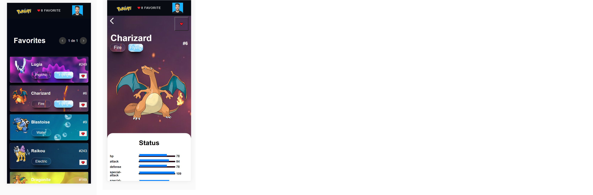

# <div align="center"> Pokemon React App</div>
<a href="https://pokemon-react-635a4.web.app/"/>
</a>
<a href="https://pokemon-react-635a4.web.app/"/>

                             </a>
<p align="center">A Responsive Pokedex made with React JS, Hooks,  consuming the pokeapi and using localstorage.</p>

## 🛠️ Technologies

<ul>
  <li><a href="https://reactjs.org/">React</a></li>
  <li><a href="https://firebase.google.com/?hl=pt-br">Firebase</a></li>
  <li><a href="https://pokeapi.co/">Poke Api</a></li>
</ul>

## ⚙️ Requirements

<ul>
  <li><a href="https://git-scm.com/">Git</a></li>
  <li><a href="https://nodejs.org/en/">Node.js</a></li>
  <li><a href="https://www.npmjs.com/">NPM</a></li>
</ul>

## 🚀 Installation

```
$ git clone https://github.com/gabrielpasquantonio/Pokemon.git
$ cd react-todolist
$ npm install
$ npm start
```

The application will open in the browser on http://localhost:3000

